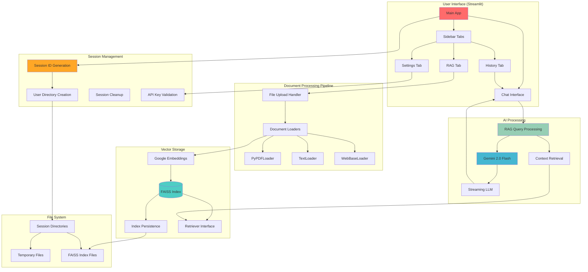

# 🤖 Ask the Docs: Mini RAG Application

<div align="center">


*A powerful Retrieval-Augmented Generation (RAG) application that transforms your documents into an intelligent knowledge base*

</div>

## ✨ Features

- 📄 **Multi-format Support**: Upload PDF and TXT documents
- 🌐 **Web Integration**: Add web links as knowledge sources
- 🤖 **AI-powered Answers**: Get intelligent responses based on your documents using Google's Gemini AI
- 💬 **Conversation History**: Track your queries with timestamps
- 🔒 **Session Management**: Private, secure sessions for data isolation
- ⚡ **Fast Retrieval**: FAISS vector database for lightning-quick searches
- 🎨 **User-friendly Interface**: Intuitive chat-like interaction

## 🏗️ System Architecture



## 🚀 Quick Start

### Prerequisites
- Python 3.8 or higher
- Google AI API key ([Get one here](https://ai.google.dev/))

### Installation

1. **Clone the repository**
   ```bash
   git clone <repository-url>
   cd ask-the-docs
   ```

2. **Install dependencies**
   ```bash
   pip install -r requirements.txt
   ```

3. **Launch the application**
   ```bash
   streamlit run app.py
   ```

4. **Configure your API key**
   - Navigate to the Settings tab
   - Enter your Google AI API key
   - Start uploading documents and asking questions!

## 🔧 How It Works

### RAG Pipeline Overview

The application implements a sophisticated RAG (Retrieval-Augmented Generation) pipeline:

#### 1. 🔐 Session Initialization & API Validation
```python
validate_api_key(api_key)
initialize_llm(api_key, streaming=False)
```
- **Unique Session IDs**: UUID-based session isolation
- **API Key Validation**: Real-time Google API key verification
- **Session-specific Directories**: Isolated file storage per user
- **Automatic Cleanup**: 24-hour session expiration

#### 2. 📥 Document Processing
```python
load_documents(file_paths, links)
```
- **Multi-format Support**: PyPDFLoader, TextLoader, WebBaseLoader
- **File Upload Handling**: Session-specific temporary file storage
- **Web Content Integration**: Direct URL content extraction
- **Error Handling**: Graceful failure for unsupported formats

#### 3. 🧩 Vector Embedding & Indexing
```python
create_faiss_index(documents)
```
- **Google Embeddings**: Uses `models/embedding-001` for consistency
- **FAISS Integration**: High-performance similarity search
- **Batch Processing**: Efficient handling of multiple documents
- **Index Persistence**: Automatic saving to session directories

#### 4. 🔍 Retrieval System
```python
get_retriever(faiss_index)
answer_with_rag(query, retriever, llm)
```
- **Semantic Retrieval**: Context-aware document matching
- **Gemini-Optimized**: Returns raw context for better Gemini processing
- **Fallback Handling**: Standard RetrievalQA for other models
- **Real-time Search**: Sub-second query processing

#### 5. 💬 Streaming Chat Interface
```python
stream_llm_response(llm_stream, messages)
```
- **Real-time Streaming**: Live response generation with Gemini 2.0 Flash
- **RAG Integration**: Contextual responses based on uploaded documents
- **Message History**: Persistent conversation tracking
- **Error Recovery**: Graceful fallback when RAG fails

## 🎨 User Interface Components

### Main Features

#### 🔐 Session Management
- **Unique Session IDs**: Each user gets a UUID-based isolated session
- **API Key Validation**: Real-time Google API key verification before processing
- **Automatic Cleanup**: Sessions expire after 24 hours for privacy
- **Manual Session Deletion**: Users can instantly delete their session data

#### 💬 Tabbed Sidebar Interface
- **Settings Tab**: API key management and validation status
- **RAG Tab**: Document upload, web link processing, and RAG toggle
- **History Tab**: Timestamped question history for reference

#### 📄 Document Processing
- **File Upload**: Drag-and-drop support for PDF and TXT files
- **Web Integration**: Direct URL processing for web content
- **Batch Processing**: Handle multiple files and links simultaneously
- **Session Isolation**: All files stored in user-specific temporary directories

## 🔒 Privacy & Security

### Data Isolation & Privacy
- **Session-based Storage**: UUID-generated directories for complete user isolation
- **Automatic Cleanup**: Sessions automatically expire after 24 hours
- **Manual Control**: Users can instantly delete all session data
- **No Cross-contamination**: Each session has completely separate file storage

### Security Features
- **API Key Protection**: Keys stored only in Streamlit session state, never persisted
- **Temporary File Handling**: All uploads stored in secure session-specific temp directories
- **No Persistent User Data**: No permanent storage of user documents or conversations
- **Real-time Key Validation**: API keys validated before any processing begins

## 📊 Performance Characteristics

| Feature | Performance | Implementation Detail |
|---------|-------------|----------------------|
| Session Initialization | <1 second | UUID generation + directory creation |
| API Key Validation | 2-3 seconds | Live test request to Gemini API |
| Document Processing | ~2-5 seconds per MB | PyPDFLoader/TextLoader + embedding generation |
| Vector Search | <100ms per query | FAISS similarity search |
| Answer Generation | 2-8 seconds | Streaming Gemini 2.0 Flash responses |
| Index Persistence | <1 second | Local file system save/load |
| Session Cleanup | Automatic | 24-hour expiration + manual deletion |

## 🛠️ Technical Stack

- **Frontend Framework**: Streamlit with custom HTML components
- **AI Model**: Google Gemini 2.0 Flash for chat and embeddings
- **Vector Database**: FAISS for efficient similarity search
- **Document Processing**: LangChain with specialized loaders:
  - `PyPDFLoader` for PDF files
  - `TextLoader` for plain text files  
  - `WebBaseLoader` for web content
- **Embeddings**: Google's `models/embedding-001`
- **Session Management**: UUID-based isolation with automatic cleanup
- **File Storage**: Session-specific temporary directories
  
## 🚀 Deployment (Docker + AWS EC2)

This project is deployed using Docker and AWS EC2 (Free Tier). Below is the complete deployment workflow.

### 1. Build Docker Image Locally

Make sure your `.env` file (containing sensitive keys like `GOOGLE_API_KEY`) is excluded from the Docker image.

```bash
docker build -t askthedocs .
```
### 2. Environment Variables
A .env file is used to securely pass API keys and configuration parameters at runtime.

### 3. Image Export & Transfer
The Docker image is saved locally as a .tar file and transferred to the EC2 instance using scp.

### 4. EC2 Setup
A t3.micro EC2 instance (Amazon Linux 2023) is launched with the necessary security group rule to allow traffic on port 8501 (Streamlit default).

### 5. Container Execution
On the EC2 instance, the image is loaded and run using:
```bash
docker load -i askthedocs.tar
docker run -d -p 8501:8501 --env-file /home/ec2-user/.env askthedocs
```

### 6. Accessing the App
The app is available at:
```url
http://<your-ec2-public-ip>:8501
```

### 7. Security
SSH key permissions were adjusted to meet EC2's strict requirements, and environment variables are not hardcoded.

## 📈 Use Cases

- **Research Assistance**: Query academic papers and reports
- **Documentation Search**: Find information in technical manuals
- **Legal Document Review**: Search through contracts and agreements
- **Knowledge Management**: Create searchable company knowledge bases
- **Educational Support**: Interactive learning from textbooks and articles

## 🔄 Future Enhancements

- [ ] Support for additional file formats (DOCX, PPTX)
- [ ] Multi-language document support
- [ ] Advanced filtering and search options
- [ ] Batch document processing
- [ ] Integration with cloud storage services
- [ ] Export conversation history
- [ ] Advanced analytics and usage metrics

---

<div align="center">

**Built with ❤️ using Streamlit and Google AI**

*Transform your documents into intelligent, queryable knowledge bases*

</div>
